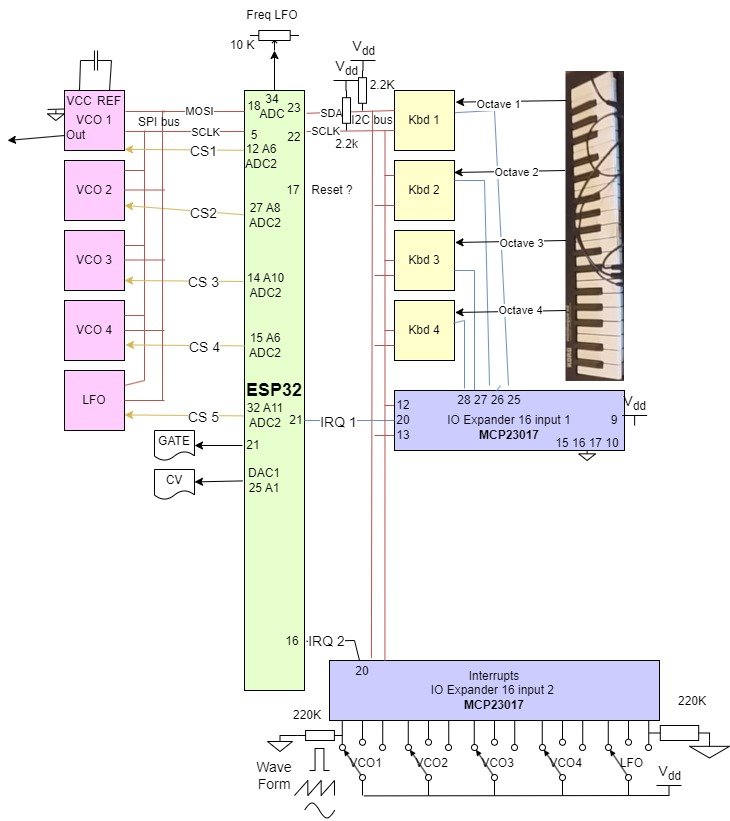

# synthe-diy
<h2>Build your own synthetiseur based on the microcontroller ESP32 with some electronic components and Python with a keyboard made with copper coins.</h2>

Release 1.0 04-10-2024

Licence
All the code, shematics and design are open-source and free of use.

<h2>How does it Works</h2>

The synthetiseur is build with a numeric motherboard wich read keys from the keyboard and send notes to oscillators.
The output of the oscillators are treated with electonic components on PCBs. The PCBs are VCF, VCA, ADSR, Noise generator and so on.
The motherboard is based on huzzah32 Adafruit ESP32.
The code is written in <a href="https://docs.micropython.org/en/latest/esp32/quickref.html#">micropython</a>

The keyboard is made with copper coins like in the <a href="https://arduino103.blogspot.com/2019/10/python-organ-creer-un-orgue.html">penny organ projet</a>.

The keys are connected to capacitives touch sensors MPR121 (one on each octave) wired on a I2C bus to the ESP32.
See <a href="https://cdn-learn.adafruit.com/downloads/pdf/adafruit-mpr121-gator.pdf">Adafruit MPR121</a> for details.
<a href="https://www.sparkfun.com/datasheets/Components/MPR121.pdf">Datasheet</a>

Sounds are generated by five AD9833 programmables waveforms generators wired on a SPI bus to the ESP32.
One of the oscillator is used as a LFO. The others are numerics VCO.
See <a href="https://protosupplies.com/product/ad9833-function-generator-module/">Ad9833</a> for details.
<a href="https://www.analog.com/media/en/technical-documentation/data-sheets/ad9833.pdf">Datasheet</a>

The output of waveforms generators are mixed with some electronic components.

One generator is used as a LFO for modulation.

The output of the mixer is sent to VCF, VCA, ADSR and so on.

All the settings are made with contactors wired to GPIO controllers MCP23017 and connected to ythe ESP32 with I2C bus and IRQs.

<h2>The shematics of the motherboard</h2>
This shematics is not up to date.

